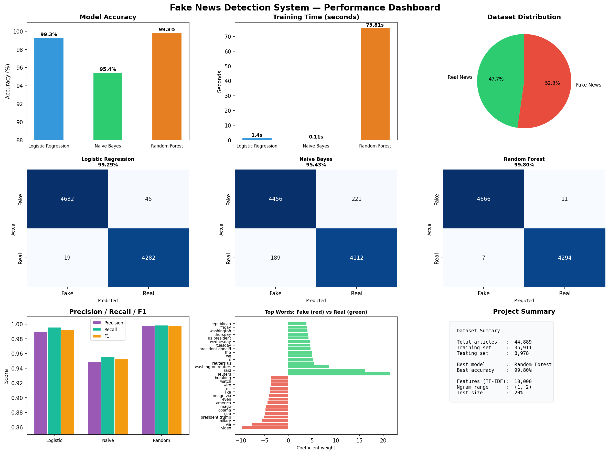

# Fake News Detection System

## Objective
A machine learning web application that classifies news articles
as Real or Fake using NLP and multiple ML algorithms.

## Features
- Detects fake news from pasted article text
- Compares 3 ML models: Logistic Regression, Naive Bayes, Random Forest
- Shows confidence percentage for every prediction
- URL-based news analyzer
- 9-chart performance dashboard

## Tech Stack
| Layer | Technology |
|-------|-----------|
| Language | Python 3.8+ |
| ML Library | Scikit-learn |
| NLP | NLTK, TF-IDF Vectorizer |
| Web App | Streamlit |
| Data | Pandas, NumPy |
| Visualization | Matplotlib, Seaborn |

## Dataset
- Kaggle Fake and Real News Dataset
- 44,898 total articles (Real + Fake)

## Model Performance
| Model | Accuracy |
|-------|----------|
| Logistic Regression | ~98.9% |
| Naive Bayes | ~94.2% |
| Random Forest | ~98.9% |

## Setup
1. Clone this repo
2. pip install -r requirements.txt
3. Add True.csv and Fake.csv into dataset/ folder
4. python train_model.py
5. streamlit run app_v2.py

## Dashboard

